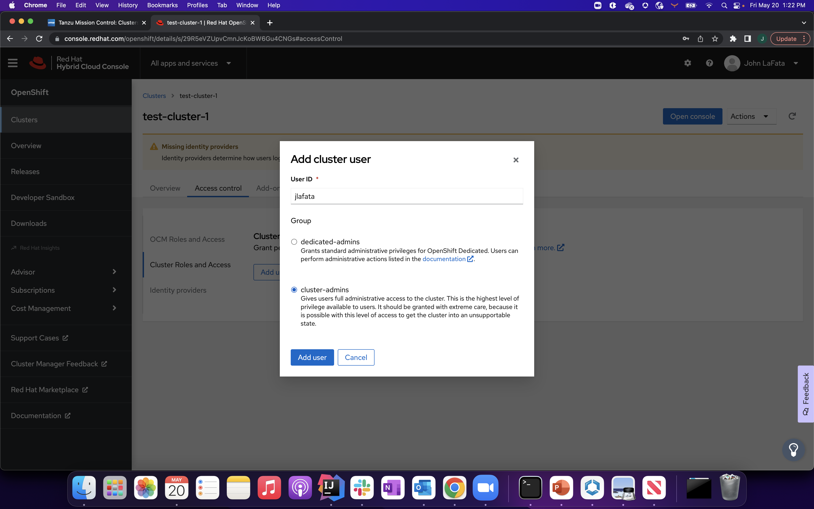
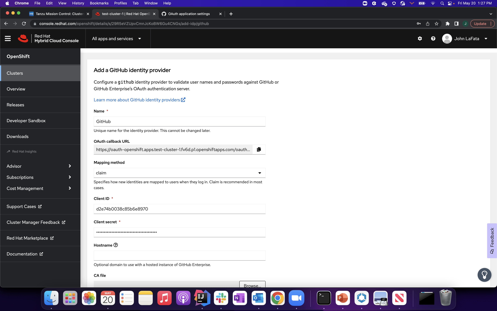
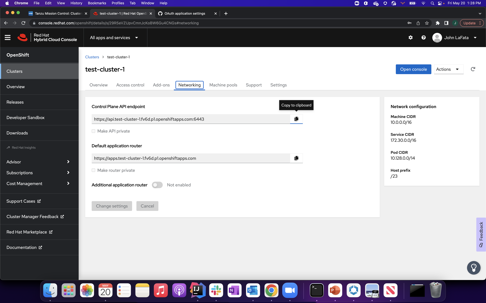

#pre-requisites
a redhat account, an aws account (with Redhat openshift enabled), rosa and oc cli's installed locally

##### create cluster via rosa cli
`export CLUSTER_NAME=test-cluster-1`

`./rosa create cluster --cluster-name $CLUSTER_NAME --sts --role-arn arn:aws:iam::806421138648:role/ManagedOpenShift-Installer-Role --support-role-arn arn:aws:iam::806421138648:role/ManagedOpenShift-Support-Role --controlplane-iam-role arn:aws:iam::806421138648:role/ManagedOpenShift-ControlPlane-Role --worker-iam-role arn:aws:iam::806421138648:role/ManagedOpenShift-Worker-Role --operator-roles-prefix $CLUSTER_NAME-g3g3 --region us-east-1 --version 4.10.9 --enable-autoscaling --min-replicas 2 --max-replicas 4 --compute-machine-type c5.2xlarge --machine-cidr 10.0.0.0/16 --service-cidr 172.30.0.0/16 --pod-cidr 10.128.0.0/14 --host-prefix 23 --disable-workload-monitoring`

ID..    1sd8i5jpjr4uk4qd1s9scsv8bppmk805
DNS..   test-cluster-1.moi4.p1.openshiftapps.com


`../rosa create operator-roles --cluster $CLUSTER_NAME  --mode auto --yes`

`../rosa create oidc-provider --cluster test-cluster-1  --mode auto --yes`

##### after the 3 create statements the cluster will move from waiting to installing state and eventuallly to ready state
`../rosa list clusters`
```                                                   
ID                                NAME            STATE
1sd8i5jpjr4uk4qd1s9scsv8bppmk805  test-cluster-1  installing
```
##### this is an example of the ready state
`../rosa list clusters`
```
ID                                NAME            STATE
1sd8i5jpjr4uk4qd1s9scsv8bppmk805  test-cluster-1  ready
```
#### When cluster state is ready (see above), open redhat hybrid cloud console: 
https://console.redhat.com/openshift/  


#### add your github login as cluster-admin 




##### create oidc-provider in redhat console




##### create an Oauth application in github to authenticate against 


##### get api-server from networking tab 


### login
`../oc login --server https://api.test-cluster-1.fv6d.p1.openshiftapps.com:6443`
```
You must obtain an API token by visiting https://oauth-openshift.apps.test-cluster-1.fv6d.p1.openshiftapps.com/oauth/token/request
```
### get token and login with token


`../oc login --token=sha256~EBZ9yCjpIJBbQWBC-tJtIorrXTirCTKIbCgpg3kajzE --server=https://api.test-cluster-1.fv6d.p1.openshiftapps.com:6443`
```
Logged into "https://api.test-cluster-1.fv6d.p1.openshiftapps.com:6443" as "jlafata" using the token provided.

You have access to 91 projects, the list has been suppressed. You can list all projects with 'oc projects'

Using project "default".
```
